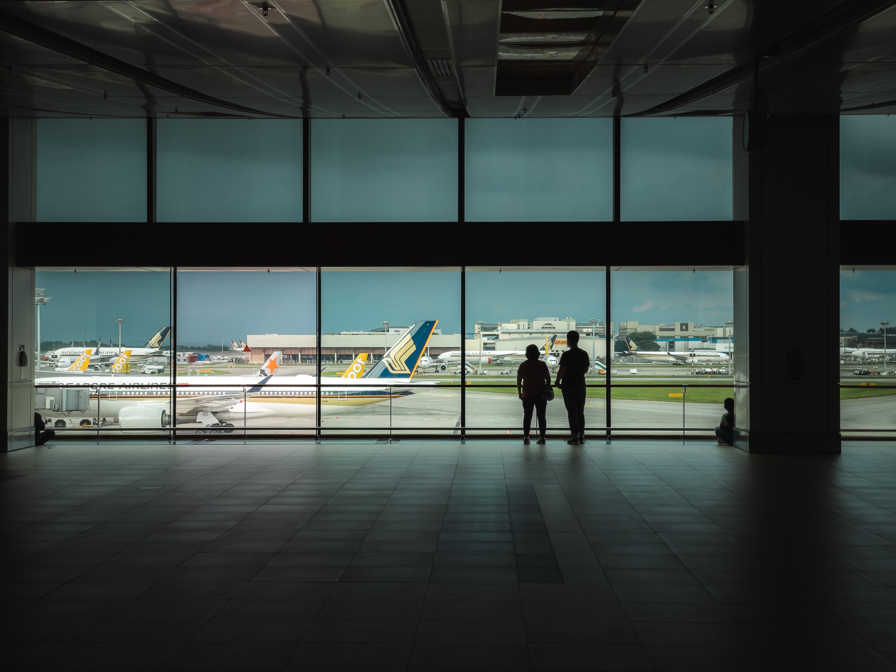
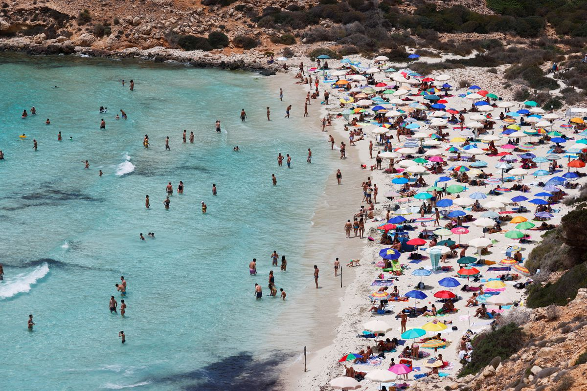

  
  


```{r setup, include=FALSE}
knitr::opts_chunk$set(fig.align = 'center', echo = TRUE, message = FALSE, warning = FALSE)
```


<div style="text-align: justify">
  <font size="3">

If there is an image that resonates with globalization for people's free movement, the scenario of a crowded airport is one of its most memorable symbols. A plane traveling across the Atlantic represented the possibility of boundless exploration, jumping across borders without hurdles or time inconveniences. 

Among the general eeriness of Spring 2020, one of the main reasons for the moment's uneasiness was the succession of shots that seemed out of place. At the apex of the pandemic first wave, the image of empty airports summarized the moment. Flying is not only an activity deeply philosophically related to human freedom, but a market that employs a tremendous amount of people and occupies a critical share of the global economy. 

According to the World Travel & Tourism Council, [travel and tourism contributed to 10.4% of global GDP in 2019](https://wttc.org/Research/Economic-Impact). Such an astounding number sharply declined to 5.5% due to the outcomes of the pandemic. Suddenly, the sector entered in free fall, forcing governments to bail out airlines and leaving thousands unemployed or in retention schemes. The World Tourism Organisation estimates a global decline in more than 70% international tourist arrivals compared with 2019.*

In 2020, as the first wave of the pandemic receded and people left their houses, there was a mixed feeling of hope alongside fears that the sector could somehow recover. Instead of catastrophic predictions that the industry would not cope, it would mean a complete rescaling of it. The summer arrived with a general will to travel that entangled social distance with common destinations. Instead of far-away destinations, countryside visits or outdoor activities could have been a reliable alternative. 

As the second year's end of the pandemic draws near, we checked the numbers. To examine the trend of tourist inflow and inspect if they adapted their vacation period or maintained old habits, prompting the sector to revert to the before times, even if in a diminished form.

</font>
</div>

<center>
{width=700px}
</center>

<div style="text-align: right"> *Source: Photo by @shawnanggg on Unsplash (2020)* </div>

#### Looking for a place under the sun in Europe

<div style="text-align: justify">
  <font size="3">

2020 and 2021 have been tough not only for the tourism sector. Even though there was a violent wreck of all economic activities related to travel, everyone felt exhausted and affected by the pandemic. Therefore, it was expected that there would be an urge to escape from the stressful and exhaustive months of the pandemic, especially after the exhausting months spent at home. 

Looking at the development of the pandemic and the distinct waves of the virus, we see in Europe a slowdown of cases during the summer months. In some regions, people have almost returned to the "normal" way of life, as if the pandemic had completely ceased or not been present. Pictures of crowded beaches in Italy, beer gardens in Austria, or full clubs and bars in Croatia conveyed a view full of life that seemed unreachable a couple of months before. 

</font>
</div>

<center>
{width=700px}
</center>

<div style="text-align: right"> *Tourists sunbathing in Italy, June 22, 2021. [REUTERS](https://www.reuters.com/world/uk/rising-delta-virus-absent-brits-dampen-europes-tourism-hopes-2021-07-01/)/Guglielmo Mangiapane*</div>

<div style="text-align: justify">
  <font size="3">
After the first hedge-like border closures in Europe during March and April 2020, it differed from other regions in the world due to its harsh restrictions that at first seemed too extreme. However, looking at the development of the number of nights spent in tourist accommodations in Europe over the months of the pandemic, the trend is almost entirely negative compared to 2019. 
 
In individual European countries, the situation varies. While southern Europe did not recover nor attract many tourists, central and northern European countries registered a slight rebound in summer.
</font>
</div>

<br>
<br>
<br>


#### Changes in tourism over the period of the pandemic in Europe
<center>
{width=700px}

</center>

<div style="text-align: right"> *The map shows the change in percent in nights spent at tourist accommodations per month per country compared to 2019 (Data for France, Bulgaria, Greece, Cyprus and Ireland not yet available for the whole year 2021). Source: Eurostat, 2021* </div>


#### Development of Tourism associated with the Stringency of Covid-19 Response Measures
<center>
{width=700px}
</center>


<div style="text-align: right"> *The graph shows the change in percent in nights spent at tourist accommodations per month per country comp ared to 2019 accumulated for EU-27 and the development of the average stringency of an 0-100 (100 = strictest) index of covid response measures (e.g. lockdown, border controls etc. Further information [here](https://ourworldindata.org/grapher/covid-stringency-index)*</div>


#### Average decline in Tourism and Stringency of Covid Response Measures in Summer 2020/2021
<center>
```{r, echo=FALSE,out.width="50%", out.height="20%",fig.cap="caption",fig.show='hold',fig.align='center'}

knitr::include_graphics(c('graphs/tourism_summer_total.png', 'graphs/summer_covid_measures.png'))

```
</center>

<div style="text-align: right"> *The left graph shows average index 0-100 (100 = strictest) for July and August in 2020 and 2021 of covid response measures (see above). The right graph shows average change in percent in nights spent at tourist accommodations of the months July and August in 2020 and 2021 per country compared to 2019. Malta and Cyprus were removed due to incomplete data.* </div>

<div style="text-align: justify">
  <font size="3">
There are manifold potential reasons for such trends: Differences in Covid case numbers, country-wise and even state-level changes, and variations in the stringency of response measures, especially the closure of hotels and other tourist commendations, restaurants, bars and museums, beaches, and other leisure activities certainly impacted these numbers. Border controls and entry restrictions hindered international travel, especially overseas and non-EU tourism. 
 
 
The average index of the stringency of pandemic countermeasures during the summer varied between European states. Especially in Italy, Spain, Portugal, and Greece, which had had particularly bad experiences during the first waves of the pandemic, measures remained severe during the summer months. 

The four countries also recorded the largest overall decline in tourists' stays compared to the summer season in 2019. The circumstances for the other countries are heterogeneous. That means that pandemic response measures are not the sole reason for the statistically recorded decline of tourists. Probably, the dependence on international tourism is equally important. 

Most Americans, for example, prefer to spend vacations visiting the acropolis or the coliseum under the sun of southern Europe than engaging in outdoor sports in Scandinavia or visiting the nascent cities of the Baltic states. As a matter of fact, The Guardian reported during that summer that the greek industry sector sharply dipped by the EU-US travel ban causing the absence of direct flights arrivals from America. 

#### Europeans staying at home in summer

But what is the picture if we look only at the development of domestic tourism? Many EU citizens decided to travel at short notice during the past two summer seasons and often stayed in their own countries. Looking at the average change in nights stayed at tourist accommodations by nationals, this is true for most states which even experienced an increase in numbers compared to 2019. 


</font>
</div>

#### Domestic Tourism in the Summer 2020/2021

<center>
{width=700px}
</center>

<div style="text-align: right"> *The graph shows average index 0-100 (100 = strictest) for July and August in 2020 and 2021 of covid response measures (see above). Malta and Cyprus were removed due to incomplete data.* </div>

<div style="text-align: justify">
  <font size="3">
Surprisingly, Slovenians discovered the vibrancy of their small cities and the beauty of the Alps and the Mediterranean in their own country. Domestic tourism more than doubled in July and August (2020/2021) compared to the pre-pandemic summer. Thus, European tourists do not seem to have canceled their summer holidays but have adapted their travel habits to the new situation.

#### Europeans discover outdoor activities

As a result, camping has increased in popularity during the past two summers. Not only does camping provide entertainment in the open air, but it also allows for social distancing since every family brings their sleeping accommodations. The increased interest may also be due to an increase in pet ownership across Europe and the ability to take your dog camping instead of leaving them at a kennel or with a pet sitter.

This rising trend resulted in unprecedented sales in caravans and mobile homes. In Germany, caravan manufacturers have been hard-pressed to meet high consumer demand due to weak supply chains. The situation is similar across Europe, where production delays are causing a phenomenal market for used caravans. Reportedly, over 34,000 RVs were sold privately in the Netherlands this year. The industry has a growing share of young adult customers. Many manufacturers offer more affordable RV models, including features that appeal to active lifestyles.

Data from Eurostat on domestic tourism align with these sales numbers. On average, most EU States had an increase in nights spent on campsites during July and August in 2020 and 2021 compared to the same months in 2019. The graph below demonstrates this, with Slovenia, Belgium, and Ireland all having increases of over 50 percent. 
</font>
</div>

#### Domestic Camping Rates Summer 2020/2021 as Compared to 2019
<center>
{width=700px}
</center>

<div style="text-align: right"> *Includes nights spent in camping grounds, recreational vehicle parks, and trailer parks. Malta and Cyprus were removed from the set due to incomplete data.* </div>

<div style="text-align: justify">
  <font size="3">
If the possibilities of traveling plummeted, Europeans discovered that outdoor activities could also be adventures. One of the indirect externalities of the confinement was the craving for spending better quality time outside, thus increasing the use and demand of public spaces such as streets and parks. The Lincoln institute reported the dilemma about cities as public good instead of a platform for the commute.

In Europe, the beginning of the pandemic halted every activity. In addition to the cold, the generalized fear of acquiring the virus impelled people from getting outside frequently. However, as temperatures rose and vacations approached, the frequency of park visits soared even to comparisons with the years before covid. Looking at the numbers from Our World in Data, the summer months of 2020 revitalized park visits.


</font>
</div>

#### Development of Parks Visits in Europe compared to pre Covid-19
<center>
```{r, message=F, echo=FALSE, out.width="75%", out.height="50%"}


source("97_data_visualisation_scripts/park_visits_graph_script.R")

interact_visits

```
</center>


<div style="text-align: right"> *The graph shows average change in percent of parks visits in Europe from Google Mobility data. The percentage change is related to a baseline of days at the beginning of 2020 (the median value for the 5‑week period from January 3 to February 6, 2020).* </div>

<div style="text-align: justify">
  <font size="3">
The heightened demand could not remain unscattered amid the new crushing wave of the disease and the cold months as fall departed. However, a curious phenomenon happened. In 2021, the use of parks continuously increased without abrupt declines, contrary to 2020. It even saw visitors coming with a frequency higher than last year during the summer. 

The pandemic caused indirect effects that did not disappear after an abnormal year. The positive aspects of staying outside have created a demand for better quality time outdoors and the questioning of the purposes of the city and its public goods.

#### Implications:

If one thing is certain, the pandemic did not erase people's will to go on holiday. Almost two years after the virus breakthrough, society coped and adapted according to the possible circumstances. Certainly, there is still reservation about international traveling, especially transatlantic flights or required stays in crowded and closed airport lobbies.

The effects of successive lockdowns and movement restrictions knocked out a key sector of the global economy that had direct ramifications with a myriad of services and industries. Thus, the direct intervention of governments to save entire sectors from bankruptcy highlighted the deep tie of such enterprises, like airlines, with the whole economic ecosystem.

On the other side, it propelled a series of incentives for local and regional activities. The concept of traveling embraced not only long distances. Instead, it started to revolve around a day in the countryside or adventure-style camping overnights for newcomers. As a result, indirect benefits also appeared and surged, such as further demand for camping guides and caravans. 

The increased contact with closer nature also has a sustainability effect. As flights heavily decreased in the first pandemic year and still not fully rebounded in the second, the carbon footprint of the whole industry decreased. Certainly, it will gradually increase as the sector recovers. Still, it's a signal that there are sustainable alternatives activities closer to home. 

However, it also exposed structural problems ingrained in the tourism industry before the virus. Some cities and areas struggled with over-tourism before the pandemic. Hence the confinements could be a moment to develop creative solutions that would ease the damaging inflow of tourists. Instead, it saw an alternative line of citizens who would not be in the traditional crowds of visitors.

Consequently, overtourism became a policy problem that comprises the potential return of the Airbnb model and the threat to the lifestyles of its residents. The Washington Post exposed the dilemmas of national parks unprepared for the constant inflow of tourists and its unchanged frailty during the pandemic, as visitors from the great centers continued coming. Thus, the demand for better oversight and care highlights the pivotal role of governments in fixing the query.

Besides their economic role in supporting critical industries, governments are pressured to look inward on behalf of citizens unsatisfied with the hospitality of their cities. As the pandemic raged, public goods such as parks represented a haven for outdoor activities. During the consecutive pandemic years, the rebound of outdoor activities created a demand for public services that should serve the people. The increased conversation about the use of the city and its purpose for the people is a crucial policy problem. Thus, the transformation of cities towards a place more comfortable for society tends to increase in the next few years.

At the end of the second pandemic year, it is still hard to envisage a determinant view of what will happen with the tourism industry in the future. A compelling perspective would be a sustainable and prosperous evolution of the sector. However, the most recent predictions suggest otherwise. Instead of an orderly transition, voyagers are experimenting with every promising alternative while craving the lifestyle of times before covid. The chaotic adaptation of the sector will possibly close and open new markets. Still, it will also allow changing perspectives to those that envisage further explorations of their immediate or far away environment.

</font>
</div>