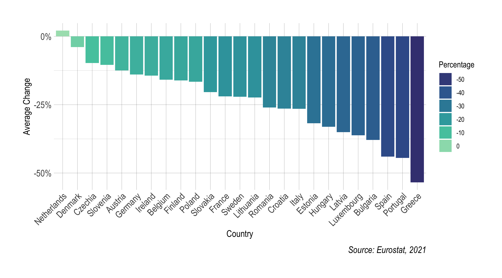
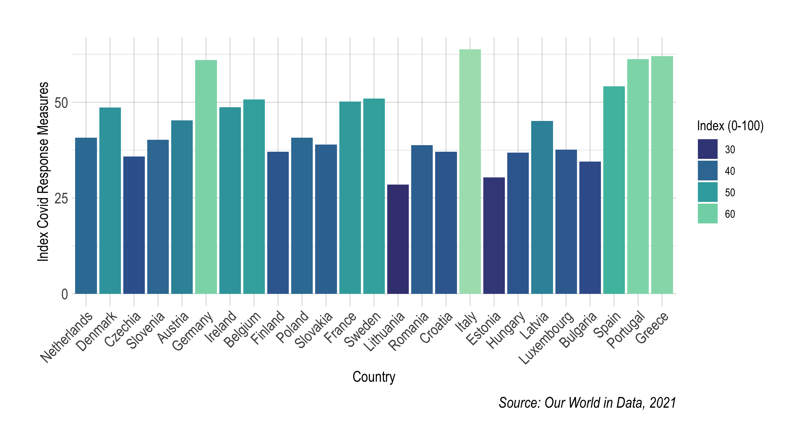

  
  


```{r setup, include=FALSE}
knitr::opts_chunk$set(fig.align = 'center', echo = TRUE, message = FALSE, warning = FALSE)
```


# Writing part

#Introduction and Context


# Development


Lisa






```{r, message=F}


```


```{r, message=F}


```


Renato

```{r, message=F}


```


```{r, message=F}


```


# Conclusion