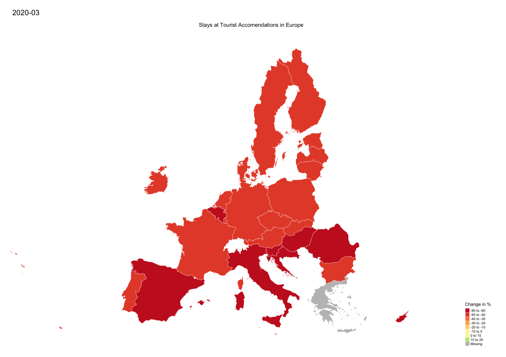
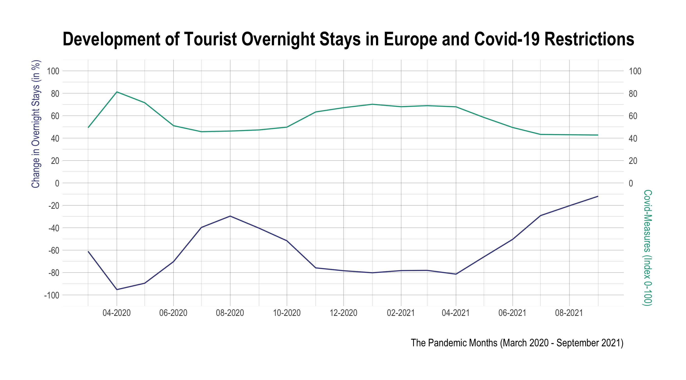
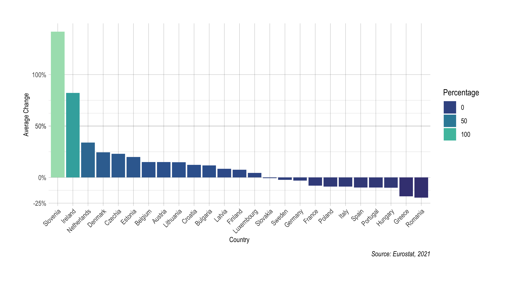
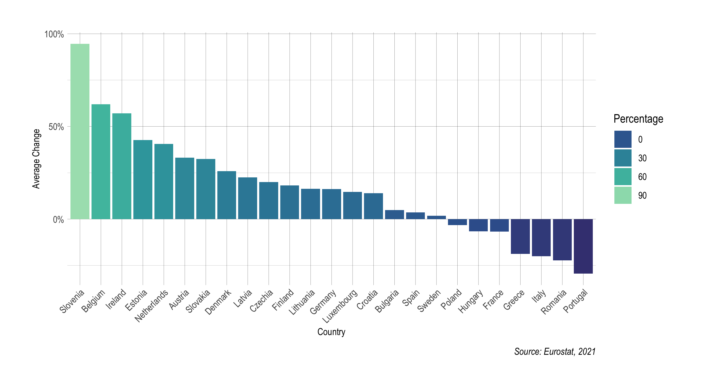

  
  


```{r setup, include=FALSE}
knitr::opts_chunk$set(fig.align = 'center', echo = TRUE, message = FALSE, warning = FALSE)
```


# Writing part

#Introduction and Context


# Development


<center>
{width=700px}


{width=700px}


```{r, echo=FALSE,out.width="50%", out.height="20%",fig.cap="caption",fig.show='hold',fig.align='center'}

knitr::include_graphics(c('graphs/tourism_summer_total.png', 'graphs/summer_covid_measures.png'))

```


{width=700px}


{width=700px}


```{r, message=F, echo=FALSE, out.width="75%", out.height="50%"}


source("park_visits_graph_script.R")

interact_visits

```


# Conclusion

</center>